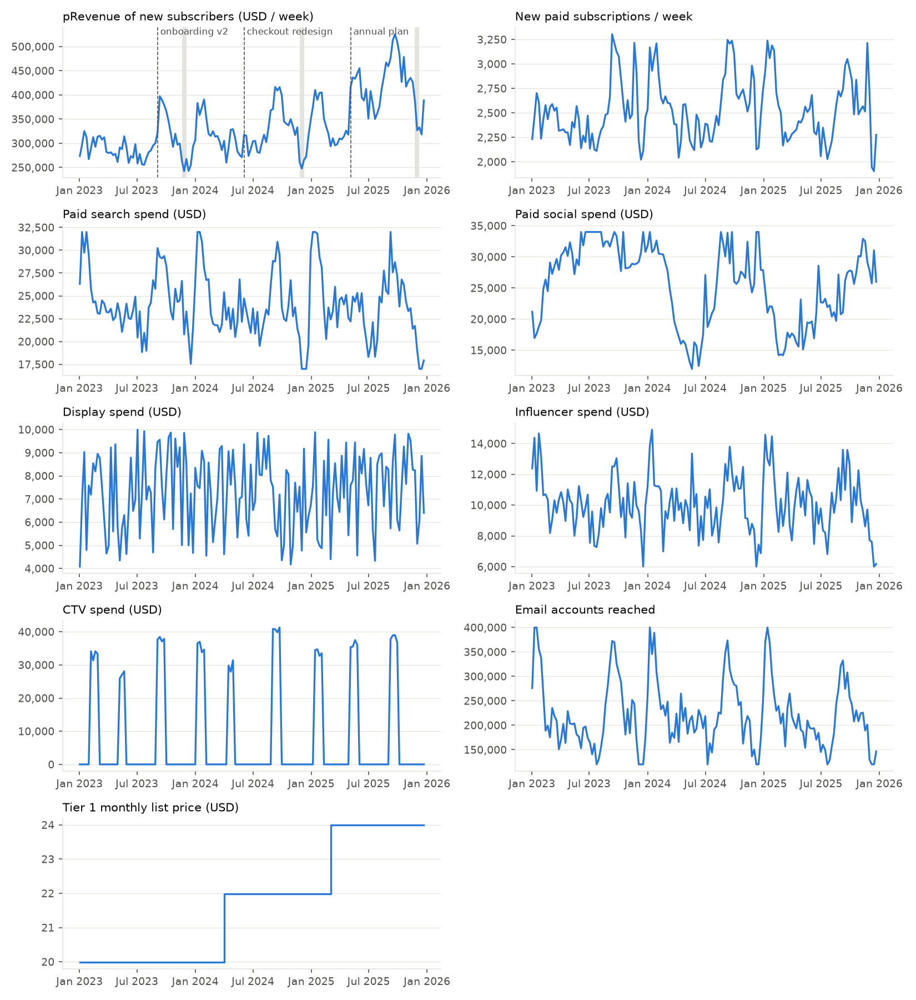
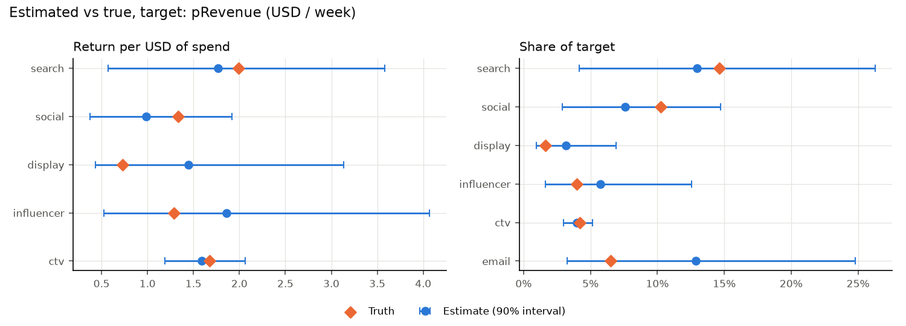
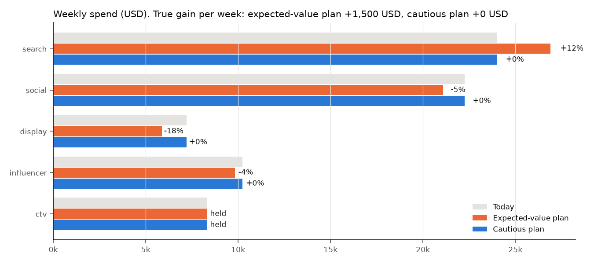

# Bayesian marketing mix model for a B2C subscription business

**Question:** which channels drive the value of new subscribers, and should the media budget move?

A Bayesian marketing mix model (MMM) in PyMC for a multi-market subscription product spending about $75k a week on media. The data is simulated, so every answer can be checked against the truth.

## Key findings

1. **The model reads the past well.** It forecasts 12 unseen weeks within 5.9%, and the true return of every channel falls inside its estimated range.
2. **Acting on its best guess is a bad bet.** Across five simulated businesses, a budget optimiser that trusts the model's central estimate lost money in three, by up to $3.5k a week, and gained at most $1.0k in the other two.
3. **The weak point is the next dollar, not the average one.** The model knows roughly what each channel has returned. It does not know what an extra dollar would return, and that is what a budget decision depends on.
4. **Experiments plus caution never lost money.** With two lift tests and the cautious rule, no run lost money, across five simulated businesses and three starting assumptions. Each falls short on its own: tests alone still lost $0.4k a week under an optimistic starting assumption, and caution alone could not always avoid a loss.

## Business implications

- **Use the MMM to decide where to test, and experiments to decide where to spend.** The model is reliable on average returns, but not on marginal ones.
- **Reallocating a fixed budget is worth little here, and getting it wrong costs more.** The best possible reshuffle adds 3.3% to media-driven pRevenue; the naive plan loses 2.7%.
- **Placing new budget well is worth more.** With 20% more budget, the calibrated model places the extra money for $17.6k a week of pRevenue, against $13.1k from the uncalibrated model: about $235k a year from the same spend.
- **Design tests around the decision.** To decide whether to scale a channel, test scaling it. Switching it off only shows its average return.

## The business

A subscription product sold in three groups of markets, priced in USD, simulated weekly from January 2023 to December 2025.

| | |
|---|---|
| New subscribers | about 395,000 in total, 1,900 to 3,300 a week |
| Markets | three price tiers (tier 2 pays 75% and tier 3 pays 50% of the tier 1 price) |
| Paid media | search, paid social, display, influencer, CTV (connected TV, run in flights) |
| Owned media | email, measured as accounts reached |
| Media budget | about $75k a week on average; CTV flights push some weeks above $100k |
| Other drivers | January and September peaks, a late-December low, Black Friday promos, three product launches, two price rises |



*Weekly pRevenue rises with each product launch and dips every December. Influencer budgets follow the same seasonal pattern as search (82% correlated), which makes the two hard to separate, as in most real media plans.*

## What the model explains: pRevenue

**pRevenue** is the predicted 24-month revenue of each week's new subscribers. A separate CLV model (customer lifetime value) scores each subscriber on plan, market tier, device, payment method, age band, sale hook (the offer that converted them), promo discount and acquisition channel. Earlier CLV analysis found that channel adds little once the other attributes are known; that is re-checked as data grows and would feed back into the MMM if it changed.

pRevenue rewards channels that bring valuable subscribers, not just many, and is known the week someone joins. A second model on new-subscriber counts runs alongside to compare volume with value.

## How the model works

Weekly pRevenue = baseline + the effect of each channel + noise.

- **Baseline:** trend, seasonality, promo weeks, product launches and price.
- **Carryover (adstock):** part of this week's spend still works next week. CTV carries over longest.
- **Diminishing returns (saturation):** each extra dollar in a channel buys a little less than the one before.
- **Priors on return per dollar:** a prior is the model's starting assumption. Each paid channel starts from "a dollar usually returns $0.5 to $4.7 of pRevenue", a belief a marketer can challenge.
- **Lift tests (optional):** an experiment result, such as "raising social spend by 50% added $12.6k a week", enters as a measured point on that channel's response curve.

## Does it work?


*Fitted pRevenue tracks the actual series closely (3.2% error in training, 5.9% on the 12 held-out weeks). The forecast misses the Black Friday spike and the December low after it: the model treats a promo as a fixed bump, although its real effect grows with demand.*



*Every true value sits inside the model's 90% range. Display and influencer are overrated: display is too small to measure, and influencer moves with search. Social is underrated, because its slow budget drift looks like trend. Email gets 13% of the credit against a true 6.5%, because it peaks in the same weeks as seasonal demand.*

## From model to budget

The optimiser reshapes a fixed weekly budget across search, social, display and influencer. CTV is held, because it is bought in flights rather than at a steady weekly level. No channel moves more than 50% from today's spend, the range the model has seen.

It compares two rules:
- **Expected value:** follow the model's central estimate.
- **Cautious:** move budget only where the gain still holds if the model is somewhat wrong (expected gain minus one standard deviation).


*What the next dollar returns at today's spend. The model ranks social lowest at 0.55, against a true 1.60, the third highest, and it is the one channel whose true value falls outside the model's range. Average returns were recovered; this marginal one was not.*


*Without experiments, the expected-value plan cuts social by 37%, moves the money into search and influencer, and loses $3.5k a week in reality. The cautious plan moves much less (social −6%) but still loses $0.4k a week.*

The true outcome of each plan, against media-driven pRevenue of about $127k a week:

| Model | Expected-value plan | Cautious plan |
|---|---|---|
| Without lift tests | −$3.5k a week (−2.7%) | −$0.4k a week (−0.3%) |
| With two lift tests | +$0.1k a week (+0.1%) | holds today's split |
| With two lift tests, budget +20% | +$17.6k a week | +$18.0k a week |
| Best possible reshuffle | +$4.2k a week (+3.3%) | |



*With a social scale-up test and an influencer scale-down test, the expected-value plan still cuts social (by 16%, not 37%), moves the money into search, and only just gains in reality (+$0.1k a week). The model gives it a 54% chance of beating today, so the cautious rule holds. The social test read low (+$12.6k against a true +$15.8k), so social stays underrated (0.79 against 1.60); search, where the model is least sure, would be the next test.*

The new-subscriber model tells the same story: without lift tests its expected-value plan loses 4 subscribers a week, with them it gains 15. Volume and value rank channels a little differently: in truth, influencer is second per dollar on subscribers but fourth on pRevenue.

## Does the starting assumption matter?

The main model starts from the belief that a paid dollar most likely returns $1.50 of pRevenue. Refitting with $1.00 and $2.50 instead:

| Prior median | Lift tests | Social's next dollar (true 1.60) | Expected-value plan (true gain/week) | Cautious plan (true gain/week) |
|---|---|---|---|---|
| 1.0 | none | 0.49 | −$3.1k | holds |
| 1.5 (main) | none | 0.55 | −$3.5k | −$0.4k |
| 2.5 | none | 0.61 | −$3.8k | −$0.9k |
| 1.0 | two | 0.76 | +$1.1k | holds |
| 1.5 (main) | two | 0.79 | +$0.1k | holds |
| 2.5 | two | 0.86 | −$0.4k | holds |

Most conclusions hold. In all six runs every true channel return stays inside the model's 90% range. Without experiments, every version rates social's next dollar lowest, and the expected-value plan cuts social by over a third and loses money. The lift tests cut the losses: the expected-value plan gains under two of the three priors and loses $0.4k a week under the optimistic one, and the cautious plan holds today's split under all three. With an optimistic prior and no tests, even the cautious plan trims social and loses $0.9k a week, so caution limits losses rather than preventing them.

## Does it hold beyond one simulated business?

A real project has one dataset and no known truth, so this is a check of the method, not a step you would run on live data. Four more businesses were simulated with different random seeds, each with its own lift tests measured with realistic error, and the analysis was repeated.

| Lift tests | Plan | Beats today | Holds today | Loses | Median true gain per week (range) |
|---|---|---|---|---|---|
| none | Expected-value | 2 of 5 | 0 | 3 | −$0.6k (−$3.5k to +$1.0k) |
| none | Cautious | 1 of 5 | 3 | 1 | $0 (−$0.4k to +$0.4k) |
| two | Expected-value | 5 of 5 | 0 | 0 | +$1.6k (+$0.1k to +$2.4k) |
| two | Cautious | 2 of 5 | 3 | 0 | $0 ($0 to +$1.8k) |

Without experiments, the expected-value plan is a poor bet: it lost money in three of five worlds and gained little in the others. With the two lift tests, it beat today's split in all five. The cautious rule with lift tests never lost, but held today's split in three of the five.

## Limitations

- The data is simulated. Its true process differs from the model's assumptions, but less than real data would.
- The lift tests are simulated, not run. A follow-up project on geo-test design covers how to run and read them.
- One model covers all markets. Promo effects are fixed, and CTV is evaluated on its average weekly spend rather than by flight.

## Next steps with real data

1. **Run the two experiments for real:** a 50% scale-up of social and a scale-down of influencer, in matched regions, for at least six weeks. Then a search test, where the model is least sure.
2. **Split the model by market tier,** sharing information across tiers (a hierarchical model), so each tier gets its own response curves.
3. **Re-check the pRevenue assumptions** every quarter: whether channel still has little effect on value, and whether CLV model updates shift the series. Re-score history after any model change.
4. **Refit monthly and track the forecast error** on new weeks, with an alert if it drifts above 8%.
5. **Back-test on real data** by fitting on history up to a point and forecasting the following months, repeated several times; and track whether channel estimates stay stable from one monthly refit to the next.
6. **Model CTV by flight,** to plan flight timing and length rather than a weekly average.

---

<details>
<summary>Repository and how to run</summary>

```
src/mmm/
  simulate.py     data generator, with ground truth
  transforms.py   carryover and diminishing returns
  data.py         model inputs
  model.py        PyMC model, with return-per-dollar priors and lift tests
  optimize.py     response curves, marginal returns, budget optimiser
  truth.py        true response curves, for evaluation only
scripts/
  fit_model.py        fit, check, compare with truth
  optimize_budget.py  budget plans and their true outcome
  plot_data.py        overview of the simulated data, and facts quoted here
  make_lift_tests.py  simulated lift tests: true lift plus measurement error
  prior_sensitivity.py, seed_robustness.py   summaries of the checks
data/             weekly data, subscriber data, lift tests, truth
artifacts/        charts, tables and saved model results
tests/            unit tests
```

Open in GitHub Codespaces (the dev container installs everything), or use Python 3.12:

```
pip install -r requirements.txt && pip install -e .
bash scripts/run_all.sh         # data, tests, model fits, budget plans, prior check: about 40 minutes
bash scripts/run_robustness.sh  # the same analysis on four more simulated businesses
```

Numbers can vary slightly between machines.
</details>

Built by Milesh Vadodaria, with AI assistance for code. Modelling choices, checks and conclusions are my own.
